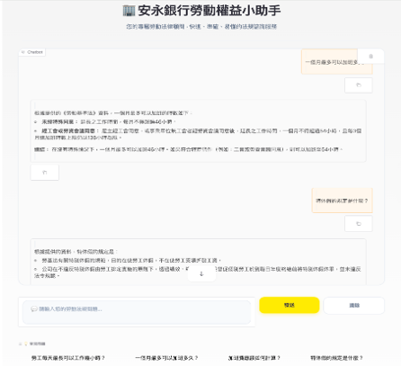

# 安永銀行勞動權益小助手

一個基於台灣《勞動基準法》的 **RAG 聊天機器人**，使用 **BM25 + FAISS + RRF 混合檢索**，搭配 **Gemma-3-4B-it** 生成回應。  
支援 K-Fold 交叉驗證評估，並提供美觀的 Gradio 網頁介面。

> ⚠️ **重要提醒**：本工具由 AI 驅動，回答僅供參考，**不構成正式法律意見**。

## 🎯 功能特色

- **全域索引僅法條**：知識庫只包含法條，避免 Q&A 汙染檢索。
- **混合檢索 (Hybrid Retrieval)**：BM25 關鍵字 + FAISS 語意 + RRF 融合。
- **路由機制**：自動判斷問題是否與勞動法相關，無關問題會禮貌拒絕。
- **K-Fold 評估**：使用完整 Q&A 資料集進行 5-Fold 驗證，計算語意相似度來評分。
- **Gradio 介面**：EY 企業色系、深淺色模式、範例問題、聊天歷史、複製按鈕。
- **多輪對話支援**：完整保留上下文，適合連續提問。

## 📸 介面預覽
  

## 🛠️ 檔案結構
Law-Chatbot/
├── File/
│   ├── labor_law_articles/      # 法條文字檔
│   └── labor_law_qa.docx        # Q&A 評估資料
├── image/
│   ├── interface.png            # 介面截圖
│   └── evaluate.png             # 評估截圖
├── interface.py                 # Gradio 介面
├── main_code.py                 # 主程式（資料處理、索引、RAG、評估）
└── README.md                    # 本文件

## ⚖️ 免責聲明
本專案僅供學習與參考使用，不提供任何法律效力。如需正式法律意見，請諮詢專業律師。